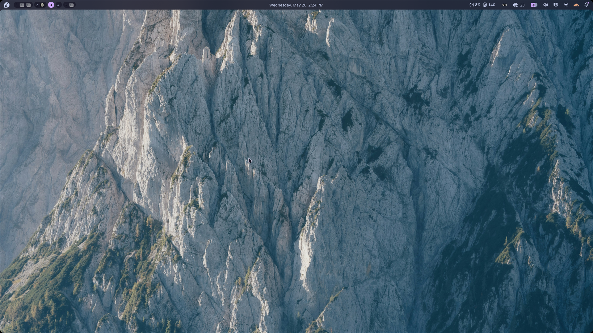
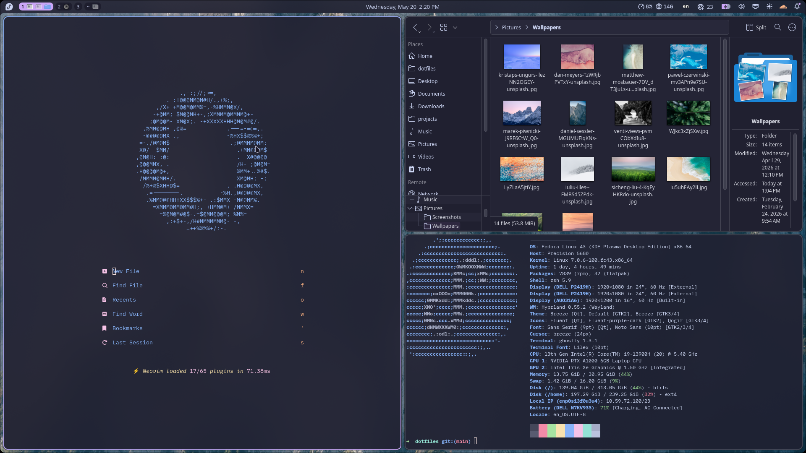

# dotfiles

Personal dotfiles managed with [GNU Stow](https://www.gnu.org/software/stow/). Features a "riced" hyprland config with a catppucin-based theme.




## Structure

Each directory is a **stow package** mirroring the target directory tree relative to `$HOME`:

```
dotfiles/
├── zsh/
│   └── .bashrc
└── astronvim/
    └── .config/
        └── nvim/
            └── init.lua
```

## Usage

Clone the repo and use `stow` from within the `dotfiles` directory:

> Note: For stow to work, the dotfiles repository MUST be a subdirectory of $HOME. Stow will by always symlink packages to the parent directory.

```bash
git clone <repo-url> ~/dotfiles
cd ~/dotfiles

# Symlink a package
stow zsh

# Symlink multiple packages
stow zsh astronvim

# Remove symlinks for a package
stow -D zsh
```

Stow creates symlinks in the parent directory (`$HOME` by default), so `dotfiles/zsh/.zshrc` becomes `~/.zshrc`.

## ZSH Configuration

The zsh package provides a `.zshrc` file which can be customized with a `.zshrc.local` file. This file will be automatically created by `.zshrc` if it does not exist.
